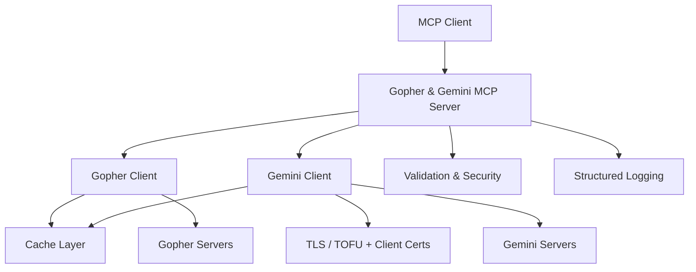

# Gopher & Gemini MCP

A cross-platform **Model Context Protocol (MCP)** server that lets LLMs browse
[Gopher](<https://en.wikipedia.org/wiki/Gopher_(protocol)>) and
[Gemini](https://geminiprotocol.net/) resources safely and efficiently.

## Overview

Gopher MCP bridges modern Large Language Models with two of the small internet's
most enduring protocols, enabling assistants like Claude to explore the content
and communities of Gopherspace and Geminispace. It implements the Model Context
Protocol specification and works with any MCP client, including Claude Desktop.

## Key Features

- **Dual Protocol Support**: Browse both Gopher and Gemini from a single server
- **Safe & Secure**: Timeouts, size limits, input validation, host allowlists, and SSRF protection
- **Gemini Security**: TLS encryption with Trust-on-First-Use (TOFU) certificate validation and client certificates
- **High Performance**: Async implementation with intelligent per-protocol caching
- **Structured Output**: Returns LLM-optimized JSON responses for every content type
- **Cross Platform**: Works on Linux, macOS, and Windows

## Quick Start

### Installation

```bash
# Zero-install: fetch and run the published package on demand
uvx gopher-mcp

# Or install from PyPI
pip install gopher-mcp

# Or with uv
uv add gopher-mcp
```

For a development setup from source, see the [Installation Guide](installation.md).

### Basic Usage

```bash
# Run with stdio transport (for Claude Desktop)
gopher-mcp

# Run with streamable HTTP transport
gopher-mcp --transport streamable-http

# Run with SSE transport
gopher-mcp --transport sse
```

### Example Tool Usage

The server exposes four MCP tools: `gopher_fetch` and `gemini_fetch` for single
resources, plus `gopher_batch_fetch` and `gemini_batch_fetch` for fetching
several URLs at once. For example, `gopher_fetch` retrieves any Gopher resource:

```json
{
  "tool": "gopher_fetch",
  "arguments": {
    "url": "gopher://gopher.floodgap.com/1/"
  }
}
```

See the [API Reference](api-reference.md) for every tool, parameter, and
response type.

## Supported Gopher Types

| Type | Description | Response Format |
|------|-------------|-----------------|
| `0` | Text file | Structured text with metadata |
| `1` | Directory/Menu | JSON array of menu items |
| `7` | Search server | Menu results from search query |
| `4,5,6,9,g,I` | Binary files | Metadata only (size, MIME type) |

Gemini content is returned as parsed gemtext (links and headings preserved),
raw success bodies, input prompts, redirects, or structured errors. See
[Gemini Support](gemini-support.md) for details.

## Architecture



## Documentation

- [Installation Guide](installation.md)
- [Configuration Guide](configuration.md)
- [API Reference](api-reference.md)
- [Advanced Features](advanced-features.md)
- [AI Assistant Guide](ai-assistant-guide.md)
- [Architecture](architecture.md)
- [Troubleshooting](troubleshooting.md)
- [Gemini Protocol Support](gemini-support.md)
- [Gemini Configuration](gemini-configuration.md)
- [Migration Guide](migration-guide.md)
- [Task Runner](task-runner.md)

## Contributing

We welcome contributions! Please see our [Contributing Guide](contributing.md) for details.

## License

This project is licensed under the MIT License — see the
[LICENSE](https://github.com/cameronrye/gopher-mcp/blob/main/LICENSE) file for details.

## Acknowledgments

- Built on the [MCP Python SDK](https://github.com/modelcontextprotocol/python-sdk) and [FastMCP](https://github.com/jlowin/fastmcp)
- Inspired by the [MCP reference servers](https://github.com/modelcontextprotocol/servers)
