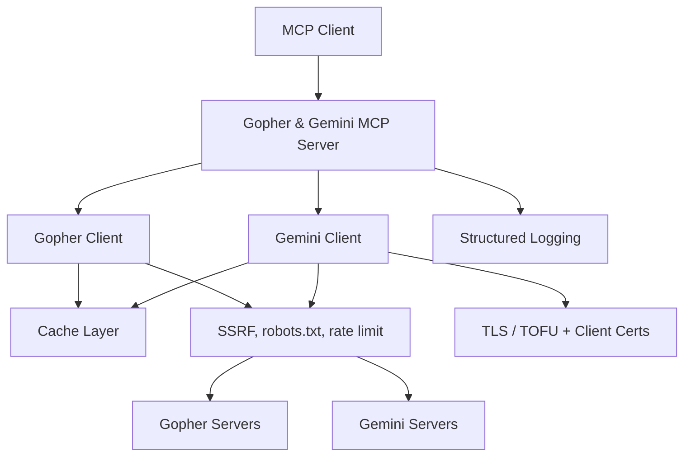

# Gopher & Gemini MCP Server

An MCP server that lets a language model browse
[Gopher](<https://en.wikipedia.org/wiki/Gopher_(protocol)>) and
[Gemini](https://geminiprotocol.net/) — the two protocols of the small internet —
and gives it structured, bounded, self-describing results instead of a wall of
scraped text.

```bash
uvx gopher-mcp
```

## Why this exists

A model can already be handed a page. What it cannot do on its own is decide
whether the page is fresh, whether the link it wants to follow is real, whether
the certificate changed since last week, or whether the operator asked
automated clients to stay out. This server makes those judgements answerable
from the payload, and makes the unsafe defaults unavailable.

**Results are typed, not prose.** Every response carries a `kind` — `menu`,
`text`, `binary`, `gemtext`, `success`, `input`, `redirect`, `certificate`,
`error` — and both fetch tools advertise that as a real `outputSchema`: a
discriminated union, not an open object. A model branches on `kind` rather than
pattern-matching English.

**Context is treated as the scarce resource.** Binary bodies are never
returned, only their size and MIME type — a 1 MB file is ~350k tokens of base64
the model cannot render anyway. Parsed gemtext carries each line exactly once:
`type` plus the raw line, plus only what the marker cannot say (the resolved
link target, the heading level, a preformat block's language). Nothing is
shipped twice.

**Truncation is not a dead end.** A result cut at the 50,000-character render
cap says how much there is (`total_items` or `total_chars`) and where the rest
begins (`next_offset`). Pass that back as `offset` and keep reading until
`next_offset` is null. For gemtext the boundary lands on the last complete
line, so consecutive windows abut exactly.

**The safe default is the only default that costs nothing.** Loopback and
private addresses are refused unless you opt in (`allow_local_hosts`);
`/robots.txt` is fetched and honoured before the first request, including rules
that name AI crawler tokens; outbound requests are paced at one per second per
host, because Gopher holes and Gemini capsules are hobbyist machines. Responses
are capped at 1 MB on the wire and cached for five minutes, and a replayed
result says `cached: true` with the age in seconds so a model can decide for
itself whether to `refresh`.

**Gemini's trust model is exposed, not hidden.** Certificates are pinned
trust-on-first-use in a real per-user data directory
(`$XDG_DATA_HOME/gopher-mcp/`, or the platform equivalent), and a changed
fingerprint is a `CERTIFICATE_CHANGED` failure with a tool to inspect and
resolve it — not a silent re-pin. Client identities for status-60 capsules are
minted, scoped and destroyed through their own tools, and the private key never
appears in any payload.

**Remote content is labelled untrusted, everywhere.** Titles, menu lines, link
text, page bodies and a capsule's own error text (`error.meta`) are stranger's
input. This server keeps its own explanation in `error.message`, and the remedy
it recommends in `error.next_step`, so a hostile capsule cannot get a kilobyte
of attacker-chosen prose read as an instruction from the tool.

## Quick start

```bash
# Zero-install: fetch and run the published package on demand
uvx gopher-mcp

# Or install it
pip install gopher-mcp     # or: uv add gopher-mcp

gopher-mcp --version
```

`gopher-mcp` speaks stdio by default, which is what Claude Desktop and most MCP
clients expect. For a network deployment:

```bash
gopher-mcp --transport streamable-http --host 127.0.0.1 --port 8000
gopher-mcp --transport sse
```

Both HTTP transports answer `GET /health` with `{"status": "ok", "version": …}`,
so an orchestrator has something to probe other than a 404. Everything else is
configured through environment variables — see the
[Configuration Guide](configuration.md), or read the effective policy back over
the protocol from the `gopher-mcp://policy` resource.

## What the server exposes

Eight tools, one resource and two prompts.

| Tool | What it does |
|------|--------------|
| `gopher_fetch` | One Gopher URL. Takes `search` for type-7 servers (so query terms are never hand-built into a URL), plus `refresh` and `offset`. |
| `gemini_fetch` | One Gemini URL. Takes `input` for status-10/11 prompts, plus `refresh` and `offset`. Redirects are reported, never followed for you. |
| `gopher_batch_fetch` | Up to 50 Gopher URLs, one result per input URL, in order. Takes `refresh`. Same-host requests are still paced by the rate limit, so the speedup is across hosts. |
| `gemini_batch_fetch` | The same for Gemini. Neither batch tool takes `offset` — continue a truncated item with the single-URL tool. |
| `gemini_trust_list` | Read the TOFU pins for a host: fingerprint, when it was pinned, whether it has expired. |
| `gemini_trust_update` | Drop or re-pin a certificate, fingerprint required. The answer to `CERTIFICATE_CHANGED`. |
| `gemini_client_cert_list` | The client identities this server holds, by scope. No key material, no paths. |
| `gemini_client_cert_update` | Mint or destroy an identity for a scope. Removal destroys the private key permanently. |

`gopher-mcp://policy` renders the fetch policy actually in force — the reason a
`BLOCKED` or `BLOCKED_BY_ROBOTS` error happened — with the two storage paths
redacted. The `explore_capsule` and `summarize_gemlog` prompts encode this
server's navigation and safety rules as one-click actions.

## What comes back

`gopher_fetch` returns one of four kinds:

| `kind` | Carries |
|--------|---------|
| `menu` | `items[]`, each with a `next_url` to follow. An empty `next_url` marks a display-only info line. |
| `text` | `text`, `charset`, `bytes` |
| `binary` | `bytes` and `mime_type` only — never the content |
| `error` | `error.code` and `error.message`; nothing was fetched |

`gemini_fetch` returns one of seven: `gemtext` (a parsed document with resolved
links), `success` (non-gemtext text), `binary`, `input`, `redirect`,
`certificate` and `error`. See [Gemini Support](gemini-support.md) for the
status-code mapping, and the [Data Models](reference/models.md) reference for
every field.

### Gopher item types

| Type | Meaning | Handled as |
|------|---------|-----------|
| `1`, `7` | Directory, search server | `menu` — a search server's results are a menu |
| `0`, `h`, `3`, `i` | Text, HTML, error, info line | `text` |
| `4`, `5`, `6`, `9`, `d`, `g`, `I`, `p`, `P`, `s`, `M`, `;`, `<`, `:` | Binary, image, sound, video, PDF, document | `binary` — metadata only |
| `2`, `8`, `T` | CSO, telnet, tn3270 | `NOT_FETCHABLE` error, answered without opening a connection |

An unrecognised type is read as text, best-effort. A type field holding a
control byte is reported as an info line, so a raw escape sequence cannot reach
the model through a menu.

## Architecture


```mermaid
graph TB
    A[MCP Client] --> B[Gopher & Gemini MCP Server]
    B --> C[Gopher Client]
    B --> D[Gemini Client]
    C --> E[Cache Layer]
    D --> E
    C --> I[SSRF, robots.txt, rate limit]
    D --> I
    D --> F[TLS / TOFU + Client Certs]
    I --> G[Gopher Servers]
    I --> H[Gemini Servers]
    B --> J[Structured Logging]
```

Both protocol clients share one base: the SSRF allowlist, the robots gate, the
per-host rate limiter, the response cache and the per-fetch deadline budget are
implemented once and specialised only where the protocols genuinely differ. See
[Architecture](architecture.md) for the full picture.

## Where to go next

- **Wiring it into a client** — [Installation](installation.md), then
  [Configuration](configuration.md) for the environment variables.
- **Driving it from a model** — the [AI Assistant Guide](ai-assistant-guide.md)
  is the navigation, continuation and error-recovery playbook.
- **Every tool, parameter and error code** — [API Reference](api-reference.md)
  and [Data Models](reference/models.md).
- **Gemini's trust model** — [Gemini Support](gemini-support.md), and
  [Gemini Troubleshooting](gemini-troubleshooting.md) when a pin or a
  certificate goes wrong.

Cross-platform: Linux, macOS and Windows, Python 3.11 through 3.14.
Contributions are welcome — see the [Contributing Guide](contributing.md).
Licensed under the
[MIT License](https://github.com/cameronrye/gopher-mcp/blob/main/LICENSE), and
built on the
[MCP Python SDK](https://github.com/modelcontextprotocol/python-sdk).
